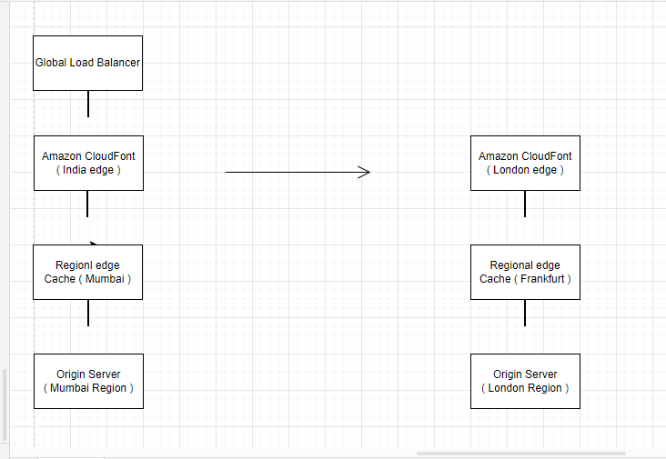
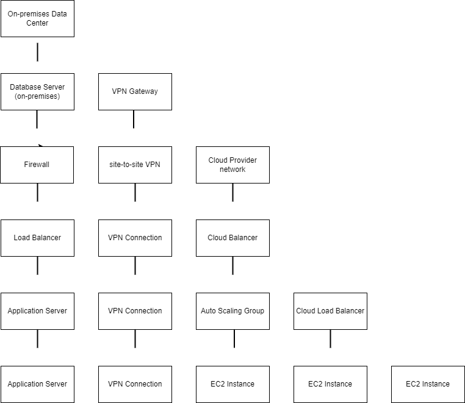

# Cloud-computing-critical-thinking1

# Scenario 1:

Global Load Balancer:
Amazon Route 53 will be used as our global load balancer 9.
It will route traffic based on latency to the nearest CloudFront edge location.
Amazon CloudFront:
We'll create two separate CloudFront distributions, one for India and one for London 2.
Each distribution will have its own origin server in the respective region.
Regional Edge Caches:
We'll utilize CloudFront's Regional Edge Caches in Mumbai and Frankfurt 2.
These caches act as mid-tier caching layers between edge locations and origins.
Origin Servers:
We'll deploy origin servers in both Mumbai and London regions.
Each origin server will serve content specific to its region when possible.
Implementation Steps
Set up Amazon Route 53:
Create a hosted zone for your domain.
Configure latency-based routing rules to direct traffic to the appropriate CloudFront distribution.
Create CloudFront Distributions:
Create two separate distributions, one for India and one for London.
Configure each distribution to use the appropriate Regional Edge Cache and origin server.
Configure Origin Servers:
Deploy EC2 instances or use AWS services like S3 in both Mumbai and London regions.
Ensure each origin has content specific to its region when possible.
Optimize Content Delivery:
Use CloudFront's features like stale-while-revalidate and stale-if-error cache control directives 2.
Implement Lambda@Edge functions for dynamic content processing at the edge 2.
Monitor and Optimize:
Use AWS CloudWatch to monitor performance metrics.
Regularly review and optimize caching strategies based on access patterns.

## add images here

# Scenario 2:
Step 1: Creating and Configuring the S3 Bucket

Log in to the AWS Management Console and navigate to the S3 service.
Click "Create bucket" and choose a unique name for your bucket.
Select a region close to your target audience for better performance.
Uncheck "Block all public access" to allow public access to your website.
Create the bucket.

Step 2: Uploading Website Files
Upload your static website files to the S3 bucket.
You can do this through the AWS Management Console, AWS CLI, or SDKs.
Step 3: Setting Permissions
Go to the bucket's permissions tab.
Edit the bucket policy to allow public read access to your website files.

Step 4: Enabling Static Website Hosting
Go to the bucket's properties tab.
Scroll down to the "Static website hosting" section.
Click "Edit" and enable static website hosting.
Set the index document (usually index.html) and error document (optional).
Save changes.

# Scenario 3:

The current on-premises infrastructure likely faces several challenges:

Single Point of Failure: Critical components may not have redundancy.
Lack of Scalability: Difficult to scale resources quickly in response to demand.
Security Vulnerabilities: Outdated systems and lack of advanced security features.
Inefficient Resource Allocation: Underutilized hardware during off-peak hours.
Proposed Solution
Our goal is to create a hybrid architecture that leverages cloud benefits while maintaining control over sensitive data. Here's an overview of the proposed solution:

Separate Database from Application
Migrate Applications to Cloud
Keep Database On-Premises
Implement Proper Security Measures
Eliminate Single Points of Failure

## add images here

